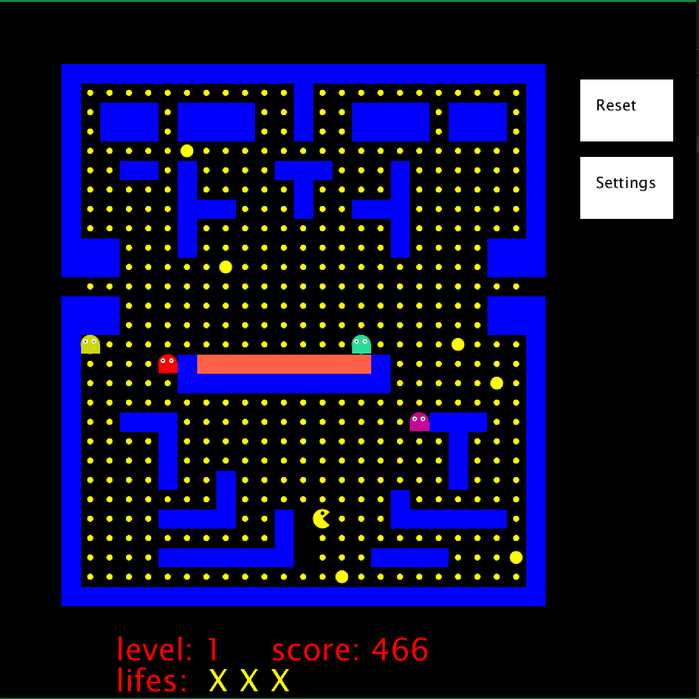

# Kurzbeschreibung Pacman

Autor: Andreas Schiefer, 5339941

## Kurzbeschreibung (50-150 Wörter)

Das Projekt orientiert sich stark an dem bekannten Videospiel Pac-Man und übernimmt viele Funktionen aus dem Spieleklassiker. Das Spielprinzip ist, dass Pac-Man Punkte in einem Labyrinth sammeln/essen muss. Verfolgt wird er dabei von vier Geistern. Gibt es eine Kollision zwischen Pac-Man und einem Geist verliert Pac-Man ein Leben. Wenn Pac-Man kein Leben mehr hat, beginnt das Spiel von vorne. Wenn er alle Punkte gegessen hat, startet das nächste Level. Es gibt einige Extrapunkte auf dem Spielfeld. Wenn Pac-Man diese sammelt/isst, dann sind die Geister in einem Unsichtbarkeits-Modus, in dem die Kollision mit Pac-Man keine Auswirkung hat. Dieser Unsichtbarkeits-Modus verschwindet nach einer gewissen Zeit. 

## Screenshot

## Bedienungshinweise

- Im Hauptmenü hat man die Auswahl zwischen dem gelben, klassischen Pacman und den blauen Krümelmonster. Außerdem muss eine Auswahl zum Theme folgen (Dark oder Light). 
Das Spiel beginnt automatisch, wenn die Auswahl getroffen wurde. 
- Im laufenden Spiel kommt man über den Klick auf den Button Settings zurück ins Hauptmenü - Das spielt ist in dieser Zeit pausiert. 
- Über den Button Reset kann man das Level erneut starten. 
- Über die Leertaste pausiert das Spiel (es erscheint auch ein entsprechender Text). Mit erneutem Klick auf die Leertaste wird das Spiel fortgesetzt. 
- Pacman wird über die Pfeiltasten bewegt. 
- Pacman und die Geister können (logischerweise) nicht in oder über die Mauern hinaus gehen. Einzige Ausnahme ist der Tunnel. Hier kann Pacman durchgehen, die Geister jedoch nicht. 
- Pacman kann jedoch nicht in den orangen Teil gehen, der ist nur für die Geister erreichbar und der "Reset-Bereich" von den Geistern. 
- Wenn man alle Leben verloren hat, beginnt das Spiel von neu. 
- Die Anzeige im unteren Teil des Spieles zeigt das aktuelle Level, wieviele Punkte noch gegessen werden müssen, die verfügbaren Leben und die Zeit in der man bereits aktiv gespielt hat. 

Das Spiel ist als Gradle-Projekt aufgesetzt und kann mit gradle run gestartet werden. Die Testfälle laufen mit gradle test.

## Dateiübersicht und Lines of Code

LOC von Draw.java
~~~
-------------------------------------------------------------------------------
Language                     files          blank        comment           code
-------------------------------------------------------------------------------
Java                             1             21              7            239
-------------------------------------------------------------------------------   
~~~

LOC von GameEngine.java
~~~
-------------------------------------------------------------------------------
Language                     files          blank        comment           code
-------------------------------------------------------------------------------
Java                             1             18              0            292
------------------------------------------------------------------------------- 
~~~
LOC Gesamt
~~~
-------------------------------------------------------------------------------
Language                     files          blank        comment           code
-------------------------------------------------------------------------------
Java                             5             56              7            633 
Bourne Shell                     1             23             36            126
Markdown						 1             17              0             67
DOS Batch                        1             21              2             66 
XML                              2              0              0             26
Gradle                           2              7             21             16 
-------------------------------------------------------------------------------
SUM:                            12            124             66            934
-------------------------------------------------------------------------------   
~~~

Auflistung relevante Dateien:
~~~
\build.gradle
\README.md
\core.jar
\app\src\main\java\pacman\App.java
\app\src\main\java\pacman\Draw.java
\app\src\main\java\pacman\GameEngine.java
\app\test\java\AppTest.java
\app\test\java\Test.java
~~~
## Verwendete Quellen

* https://processing.org/reference/ (Abruf, 22.06.2021)
* https://en.wikipedia.org/wiki/Pac-Man (Abruf, 22.06.2021)
* https://www.youtube.com/watch?v=ataGotQ7ir8 (Pac-Man Geister-KI erklärt, Abruf, 22.06.2021)
* https://openprocessing.org/sketch/663582 (openprocessing, Pacman-Sketch, Abruf, 22.06.2021)

## Eigenständigkeitserklärung

Hiermit bestätige ich, dass ich die vorgelegte Projektarbeit eigenständig und ohne fremde Hilfe erstellt habe. Ich erkläre explizit, dass ich kein Plagiat begangen habe, d.h. dass ich keinen Code/Text aus nicht dokumentierten Quellen verwendet habe und dass nicht umfängliche Teile des Codes (>= 20%) eine “Kopierleistung” sind. Quellen, die ich benutzt habe, sind vollständig in der Dokumentation angegeben. Ich bestätige außerdem, dass die Projektarbeit nicht vor dem SoSe 2021 entstanden ist und noch nirgends als Prüfungs- oder Zulassungsleistung (wie z.B. zur Klausurzulassung) vorgelegt worden ist. Mir ist klar, dass die abgegebene Prüfungsleistung für PiS annulliert wird, sollte ich keine Zulassung für PiS besitzen.

# Pacman-with-Processing
